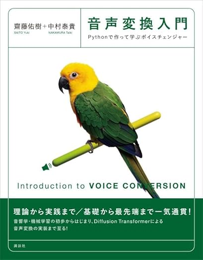

# Pythonで学ぶ音声変換 ― サポートページ

<div align="center">
  <a href="https://amzn.asia/d/04IyfN83">
    
  </a>
  <br>
  <strong>『Pythonで学ぶ音声変換』</strong><br>
  著者名 齋藤佑樹・中村泰貴著 ／ 出版社名 講談社刊<br><br>
  <a href="https://amzn.asia/d/04IyfN83">📖 Amazonで購入</a>
</div>

---

本リポジトリは、書籍『Pythonで学ぶ音声変換』のサポートページです。
パラレル音声変換から最新のゼロショット音声変換まで、4つの手法を実際に動かしながら学ぶことができます。

## 各章のコード

| ディレクトリ | 対応章 | モデル | 概要 |
|---|---|---|---|
| `parallel_vc/` | 第5章 | パラレル音声変換 | GMM・DNNによる古典的手法 |
| `auto_vc/` | 第5章 | AutoVC | Autoencoderベースのゼロショット音声変換 |
| `free_vc/` | 第7章 | FreeVC | テキスト不要のワンショット音声変換 |
| `seed_vc/` | 第8章 | SeedVC | 拡散モデルによるゼロショット音声変換 |

## 動作確認環境

- Python 3.10
- NVIDIA GPU（CUDA対応）を推奨（SeedVCなど一部モデルの実行に必要）
- OS: Windows 10以降 / macOS / Linux（Ubuntu 22.04以降）

本書では全章を通してPython 3.10で統一しています。
将来的に各モデルが新しいPythonバージョンに対応した場合は、本リポジトリも対応を更新する予定です。

## セットアップ

### 1. uvのインストール

本リポジトリでは、Pythonの環境管理ツールとして [uv](https://docs.astral.sh/uv/) を使用します。

```bash
# macOS / Linux
curl -LsSf https://astral.sh/uv/install.sh | sh

# Windows
powershell -ExecutionPolicy ByPass -c "irm https://astral.sh/uv/install.ps1 | iex"
```

### 2. リポジトリのクローンと Python のセットアップ

```bash
git clone https://github.com/supikiti/VC_book.git
cd VC_book

# Pythonをダウンロード
uv python install 3.10
```

### 3. JVSコーパスのダウンロードと配置

本書では、日本語多数話者音声コーパス「JVS (Japanese Versatile Speech) corpus」を使用します。

**ダウンロード手順：**

1. JVSコーパスの配布ページにアクセスします。
   - https://sites.google.com/site/shinnosuketakamichi/research-topics/jvs_corpus
2. ページ内の Google Drive リンクからzipファイル（約3.5GB）をダウンロードします。
3. ダウンロードしたzipファイルを解凍し、リポジトリ直下の `corpus/` ディレクトリに配置します。

```bash
# リポジトリのルートで実行
mkdir -p corpus
# ダウンロードしたzipを解凍して配置
unzip jvs_ver1.zip -d corpus/
```

配置後のディレクトリ構成が以下のようになっていることを確認してください。

```
VC_book/
├── corpus/
│   └── jvs_ver1/
│       ├── jvs001/
│       │   ├── parallel100/
│       │   │   └── wav24kHz16bit/
│       │   ├── nonpara30/
│       │   ├── whisper10/
│       │   └── falsetto10/
│       ├── jvs002/
│       ├── ...
│       └── jvs100/
├── parallel_vc/
├── auto_vc/
├── free_vc/
└── seed_vc/
```

### 4. 各モデルのセットアップと実行

試したいモデルのディレクトリに移動し、`uv sync` で環境を構築します。

```bash
# 例：FreeVCを試す場合
cd free_vc
uv sync
uv run python src/*.py
```

各ディレクトリの `README.md` に、モデルごとの詳細な実行手順を記載しています。

## 正誤表

書籍の正誤情報は [こちらのスプレッドシート]() で公開しています。

## 謝辞

本書のコードは、以下のオープンソースプロジェクトを参考に作成しています。
各プロジェクトの著者の皆様に深く感謝いたします。

- **AutoVC** ― Kaizhi Qian, Yang Zhang, Shiyu Chang, Xuesong Yang, Mark Hasegawa-Johnson
  "AutoVC: Zero-Shot Voice Style Transfer with Only Autoencoder Loss" (ICML 2019)
  https://github.com/auspicious3000/autovc

- **FreeVC** ― Jingyi Li, Weiping Tu, Li Xiao
  "FreeVC: Towards High-Quality Text-Free One-Shot Voice Conversion" (ICASSP 2023)
  https://github.com/OlaWod/FreeVC

- **SeedVC** ― Plachtaa et al.
  "Seed-VC: Zero-Shot Voice Conversion and Singing Voice Conversion with Real-Time Support"
  https://github.com/Plachtaa/seed-vc

また、本書で使用する音声データとして、以下のコーパスを利用しています。

- **JVS (Japanese Versatile Speech) corpus** ― 高道慎之介, 三井健太郎, 齋藤佑樹, 郡山知樹, 丹治尚子, 猿渡洋
  "JVS corpus: free Japanese multi-speaker voice corpus," arXiv preprint 1908.06248, 2019.
  https://sites.google.com/site/shinnosuketakamichi/research-topics/jvs_corpus

## ライセンス

本リポジトリのライセンスはディレクトリによって異なります。

- `parallel_vc/`、`auto_vc/`、`free_vc/`：[MIT License](LICENSE)
- `seed_vc/`：[GPL-3.0 License](seed_vc/LICENSE)（派生元の [Seed-VC](https://github.com/Plachtaa/seed-vc) のライセンスに準拠）

`seed_vc/` 内のコードを改変・再配布する場合は、GPL-3.0の条件に従う必要があります。
詳細は各ディレクトリ内のLICENSEファイルをご確認ください。

JVSコーパスの利用条件については、コーパス配布ページの規約に従ってください。